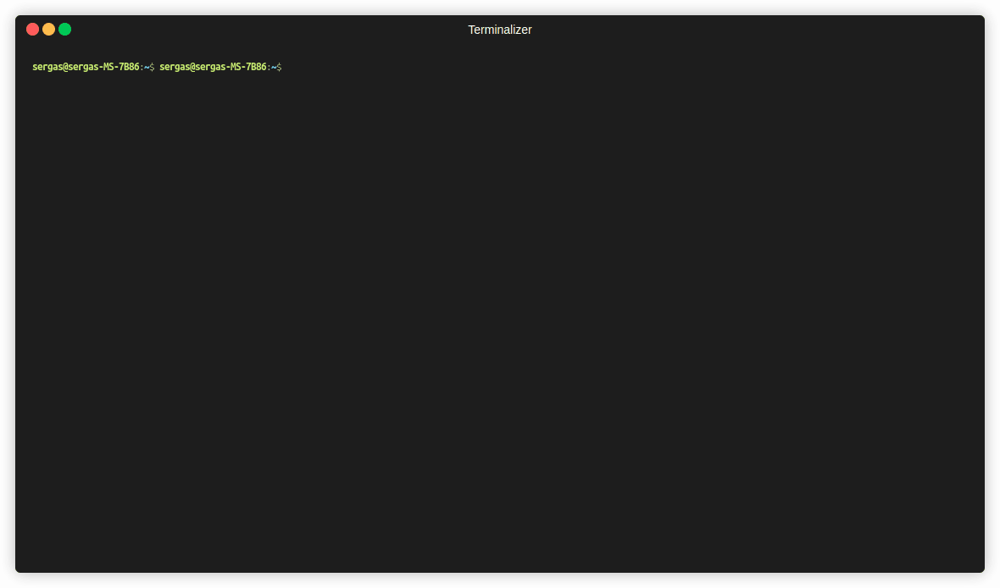

# 🚀 shAI - Your AI-Powered Local Terminal Assistant


**shAI** is a CLI tool that translates natural language into executable Linux commands and bash scripts. Built from scratch with an End-to-End MLOps pipeline, it runs **100% locally** preserving your privacy, and uses **RAG** (Retrieval-Augmented Generation) to learn your corporate documentation.

---

## 🎥 Demo



---

## ✨ Core Features

* 🔒 **100% Local & Private:** Powered by Ollama and Qwen 2.5. No internet connection required, no data leaves your machine.
* 🧠 **RAG-Powered Memory:** Ingest your own internal documentation (`shai learn`) so the AI prioritizes your company's scripts over general knowledge.
* 💻 **Zero-Shot Bash Scripts:** Generate production-ready bash scripts with brief explanations (`--bash`, `--explain`).
* 🔄 **Continuous Learning Pipeline:** Integrated SQLite telemetry to log executions and feedback for future LoRA fine-tuning.

---

## 🏗️ MLOps Architecture

This project is not just a wrapper; it includes a full Machine Learning lifecycle:
1. **Data Collection:** `telemetry.py` logs user prompts, generated commands, and OS context into a local SQLite database.
2. **Continuous Learning Pipeline (Fine-Tuning):**
   * **Export (ChatML):** The system extracts your successful local executions and explanations from SQLite, merging them with a ground truth dataset to generate a high-quality `dataset.jsonl` in ChatML format.
   * **Train (LoRA):** Custom Python scripts train a parameter-efficient LoRA adapter using HuggingFace `trl` and `peft`.
   * **Merge:** The LoRA weights are merged back into the base model (e.g., Qwen 2.5) to produce native `.safetensors`.
   * **Convert (llama.cpp):** Utilizing `llama.cpp`, the merged model is converted into a `.gguf` file format compatible with Ollama. *(Note: You must clone and build [llama.cpp](https://github.com/ggerganov/llama.cpp) inside the `scripts/` directory for this step).*
   * **Deploy:** A custom `Modelfile` packages the `.gguf` into your own `shai-expert` model.
3. **Evaluation:** Automated benchmarking (`run_evals.py`) calculating exact match and latency against a ground truth dataset.
4. **Vector Database:** LangChain and ChromaDB integration for semantic search of local documentation.
---

## 🚀 Installation & Setup

### 📋 Prerequisites
Before installing **shAI**, you need to have two main components in your system: **Ollama** (to run the AI models locally) and **uv** (for lightning-fast Python packaging).

**1. Install Ollama & download the base model:**

```bash
curl -fsSL https://ollama.com/install.sh | sh
ollama pull qwen2.5-coder
```

**2. Install `uv` (Python Package Manager):**

```bash
curl -LsSf https://astral.sh/uv/install.sh | sh
```

```bash
# 1. Clone the repository
git clone https://github.com/Sergasgr/shai.git
cd shai

# 2. Install globally using uv
uv tool install .

# 3. Initialize the environment (Downloads the embedding model)
# By default, it automatically selects your installed model. 
# You can specify a different engine using the -m flag (e.g., shai setup -m shai-expert)
shai setup
```

---

## 🕹️ Usage

`shAI` provides three main commands to interact with your system: `ask`, `learn`, `setup` and `train`.

### 1. `shai ask` (Core Engine)
Translates your natural language prompt into an executable Linux command or Bash script.

**Flags & Options:**
* `--explain` / `-e`: Generates a detailed, step-by-step explanation of the generated command or script.
* `--bash` / `-b`: Outputs a complete, raw Bash script (`#!/bin/bash`) instead of a single-line command.
* `--alias <name>` / `-a`: Automatically creates a permanent shell alias for the generated command in your `.bashrc` or `.zshrc`.
* `--save <path>` / `-s`: Saves the generated output (and explanation, if requested) to a specified file.
* `--append` / `-ap`: Used with `--save` to append the output to an existing file instead of overwriting it.
* `--yes` / `-y`: Bypasses the confirmation prompt and executes the generated command immediately.

**Examples:**
```bash
# Generate a script, explain it, and save it to a file
shai ask "monitor CPU usage every 2 seconds" -b -e --save monitor.sh

# Generate a command, save it as an alias, and execute it
shai ask "update system and clean orphans" -a update_all -y
```

### 2. `shai learn` (RAG Knowledge Ingestion)
Reads a local text file containing your personal or corporate snippets, splits it into chunks, and saves it into the local ChromaDB vector database. The AI will prioritize this knowledge in future prompts.

```bash
shai learn doc.txt
```

### 3. `shai setup` (Environment Initialization)
Initializes the local SQLite telemetry database, verifies the Ollama installation, and pulls the required `nomic-embed-text` embedding models for the RAG engine. By default, it intelligently scans your installed Ollama models, prioritizing your fine-tuned `shai-expert` if it exists, or defaulting to the base `qwen2.5-coder`.

```bash
shai setup
```

**Flags & Options:**
* `--model` / `-m`: Override the default auto-detection and specify exactly which model to use. Extremely useful when you want to switch to your custom fine-tuned model for the first time (e.g., shai setup -m shai-expert).

### 4. `shai train` (Continuous Learning & Fine-Tuning)
The true power of shAI lies in its End-to-End MLOps pipeline. The tool continuously logs your successful executions and their explanations into a local SQLite database (`feedback.db`). 

When you have accumulated enough data you can run: 

```bash
shai train
```

This command triggers the automated data pipeline:

1. **Extraction & Formatting**: Extracts your local telemetry and crosses it with a `ground_truth.json` file to generate a high-quality, ChatML-formatted dataset (`dataset.jsonl`).
2. **LoRA Fine-Tuning**: Use the provided python scripts (`scripts/train.py`) to train a parameter-efficient adapter using PyTorch and HuggingFace's peft.
3. **Merging & Conversion**: Merge the adapter with the base model (`scripts/merge.py`) and convert it to a .gguf format (`shai-bash-v1.gguf`) using llama.cpp.

#### 🐳 Deploying your custom model
You don't need to configure the model manually. The repository already includes a pre-configured Modelfile in the root directory. It contains the optimized system prompt, the strict ChatML template, and automatically points to your generated shai-bash-v1.gguf file.

To build your expert model in Ollama, simply run:

```bash
ollama create shai-expert -f Modelfile
```

#### 🔄 Switching Engines
Now that your custom model is installed, tell shAI to use it as the main engine:

```bash
shai setup --model shai-expert
```

(Note: From now on, if you ever run a plain shai setup again, the system will automatically detect shai-expert and prioritize it over the default base model).

---

> ⚠️ **Disclaimer**
>
> **shAI** generates system commands using Artificial Intelligence. The user is strictly responsible for reviewing all commands before execution. The creator assumes no liability for any system damage or data loss.

---

### 👨‍💻 About the Author

**Sergio Graciá, Sergas.** *LinkedIn:* [https://www.linkedin.com/in/sergio-gracia-](https://www.linkedin.com/in/sergio-gracia-)

## 📄 License

This project is licensed under the MIT License - see the [LICENSE](LICENSE) file for details.