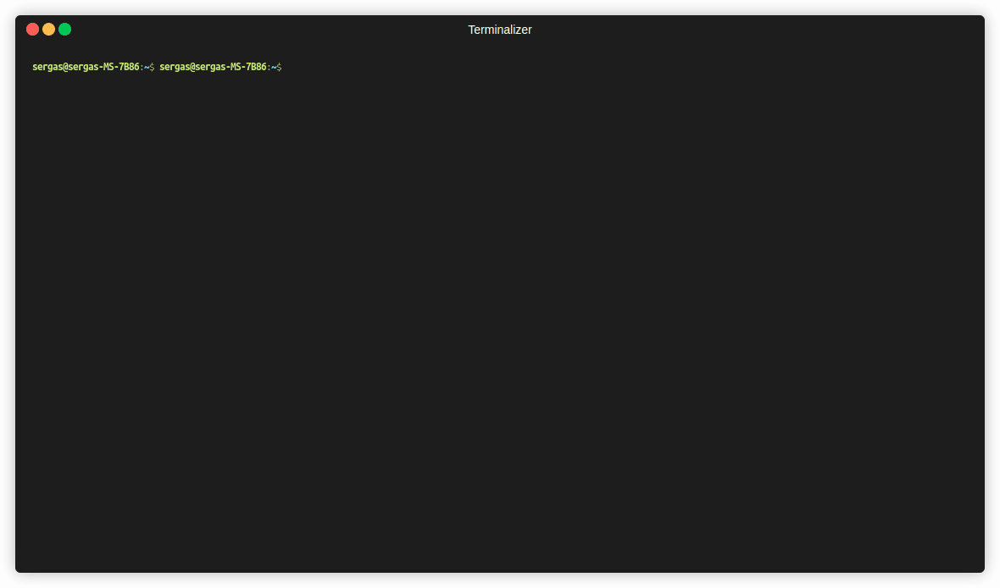

# 🚀 shAI - Your AI-Powered Local Terminal Assistant


**shAI** is a CLI tool that translates natural language into executable Linux commands and bash scripts. Powered by **Ollama** & **Qwen 2.5-Coder**, it runs 100% locally to guarantee absolute data privacy. 

Beyond standard generation, shAI features an **Agentic Auto-healing** loop to autonomously fix failed commands, a **DevSecOps** layer with Docker sandboxing for safe execution, and uses **RAG** (Retrieval-Augmented Generation) to master your corporate documentation. Built from the ground up, it includes a zero-latency, **End-to-End MLOps pipeline** for on-device LoRA fine-tuning.

---

## 🎥 Demo



---

## ✨ Core Features

* 🧠 **Agentic Auto-Healing:** Encountered an error? The `--agent` mode captures `stderr`, reasons about the failure, and self-corrects the command autonomously.
* 🔐 **Prompt Poisoning Prevention:** A proactive semantic security layer acts as a cognitive firewall before vectorizing content into the RAG database. Powered by a custom, locally fine-tuned LoRA model, it performs zero-latency mathematical inference directly in RAM to block injection attacks.
* 🛡️ **DevSecOps Sandboxing & Linter:** Built-in `shellcheck` static analysis and an optional Docker `--sandbox` to execute AI-generated commands in a zero-risk isolated environment.
* ☁️ **Cloud-Native Observability:** Export telemetry to a distributed FastAPI/Prometheus backend and monitor LLM latency and TPS (Tokens Per Second) via Grafana.
* 📚 **Hybrid RAG Memory:** Ingest corporate docs with Semantic Caching (0ms latency) and Hybrid Search (BM25 + Vector) for exact technical term retrieval.
* 🔄 **Continuous MLOps Pipeline:** Fully abstracted local Fine-Tuning pipeline to create your own `shai-expert` model without dealing with manual scripts.
* 🔒 **100% Local & Private:** Powered by Ollama. No internet connection required, no data leaves your machine.
---

## 🏗️ MLOps Architecture

This project is not just a wrapper; it includes a full Machine Learning lifecycle:
1. **Data Collection:** `telemetry.py` logs user prompts, generated commands, and OS context into a local SQLite database.
2. **Continuous Learning Pipeline (Fine-Tuning):**
   * **Export (ChatML):** The system extracts your successful local executions and explanations from SQLite, merging them with a ground truth dataset to generate a high-quality `dataset.jsonl` in ChatML format.
   * **Train (LoRA):** Custom Python scripts train a parameter-efficient LoRA adapter using HuggingFace `trl` and `peft`.
   * **Merge:** The LoRA weights are merged back into the base model (e.g., Qwen 2.5) to produce native `.safetensors`.
   * **Convert (llama.cpp):** Utilizing precompiled binaries downloaded automatically by the system, the merged model is converted into a `.gguf` file format compatible with Ollama.
   * **Deploy:** A custom `Modelfile` packages the `.gguf` into your own `shai-expert` model.
3. **Security Classifier Fine-Tuning:** The tool includes a curated dataset (`security_dataset.jsonl`) to train a lightweight LoRA adapter capable of distinguishing between safe corporate docs and jailbreak commands in multiple languages. This avoids loading massive security models into the GPU VRAM, keeping resources free for code generation.
4. **Evaluation:** Automated benchmarking (`run_evals.py`) calculating exact match and latency against a ground truth dataset.
5. **Vector Database:** LangChain and ChromaDB integration for semantic search of local documentation.

---

## 🚀 Installation & Setup

### 📋 Prerequisites
Before installing **shAI**, you need to have two main components in your system: **Ollama** (to run the AI models locally) and **uv** (for lightning-fast Python packaging).

**1. Install Ollama & download the base model:**

```bash
curl -fsSL https://ollama.com/install.sh | sh
ollama pull qwen2.5-coder
```

**2. Install `uv` (Python Package Manager):**

```bash
curl -LsSf https://astral.sh/uv/install.sh | sh
```

**🚀 Standard Installation (End Users)**
If you just want to use shAI in your terminal:
```bash
# 1. Clone the repository
git clone https://github.com/Sergasgr/shai.git
cd shai

# 2. Install globally using uv
uv tool install .

# 3. Initialize the environment (Downloads the embedding model)
# By default, it automatically selects your installed model. 
# You can specify a different engine using the -m flag (e.g., shai setup -m shai-expert)
shai setup
```

**🛠️ Local Development**
If you want to modify the code, run the security test suite, or contribute:
```bash
# 1. Clone the repository
git clone [https://github.com/Sergasgr/shai.git](https://github.com/Sergasgr/shai.git)
cd shai

# 2. Sync the environment (including development dependencies)
uv sync

# 3. Install the package in editable mode
uv pip install -e .

# 4. Run the security test suite (pytest)
uv run pytest tests/
```

**3. Install Docker for Sandbox capabilities (Optional):**
To use the --sandbox DevSecOps feature, ensure Docker is installed and running on your system.
```bash
curl -fsSL [https://get.docker.com](https://get.docker.com) -o get-docker.sh
sudo sh get-docker.sh
```

---

## 🕹️ Usage

`shAI` provides three main commands to interact with your system: `ask`, `learn`, `setup` and `train`.

### 1. `shai ask` (Core Engine)
Translates your natural language prompt into an executable Linux command or Bash script.

**Flags & Options:**
* `--explain` / `-e`: Generates a detailed, step-by-step explanation of the generated command or script.
* `--bash` / `-b`: Outputs a complete, raw Bash script (`#!/bin/bash`) instead of a single-line command.
* `--alias <name>` / `-a`: Automatically creates a permanent shell alias for the generated command in your `.bashrc` or `.zshrc`.
* `--save <path>` / `-s`: Saves the generated output (and explanation, if requested) to a specified file.
* `--append` / `-ap`: Used with `--save` to append the output to an existing file instead of overwriting it.
* `--yes` / `-y`: Bypasses the confirmation prompt and executes the generated command immediately.
* `--agent` / `-ag`: Enables the autonomous agent mode to break down complex tasks into steps and auto-heal execution errors.
* `--sandbox` / `-sb`: Executes the generated command safely inside an isolated Docker container, protecting your host machine.

**Examples:**
```bash
# 1. Scripting & Documentation: Generate a script, explain its syntax, and save it.
shai ask "monitor CPU usage every 2 seconds and log it to cpu_stats.txt" -b -e --save monitor.sh

# 2. Automation: Generate a maintenance command, save it as an alias, and execute it blindly.
shai ask "update system and clean orphaned packages" -a update_all -y

# 3. Agentic Mode: Delegate a complex, multi-step task with auto-healing capabilities.
shai ask "Find all log files over 1GB in /var/log, compress them into an archive, and delete the originals" --agent

# 4. Zero-Trust Security: Safely test potentially dangerous web scripts inside an isolated container.
shai ask "download the latest nodejs install script with curl and pipe it directly to bash" --sandbox
```

### 2. `shai learn` (RAG Knowledge Ingestion)
Reads a local text file containing your personal or corporate snippets. Before vectorization, the text is scanned by a custom-trained ML security adapter loaded via a Singleton pattern. If an injection attack is detected, the process aborts securely. If safe, it splits the document into chunks and saves it into the local ChromaDB vector database.

```bash
shai learn doc.txt
```

### 3. `shai setup` (Environment Initialization)
Initializes the local SQLite telemetry database, verifies the Ollama installation, and pulls the required `nomic-embed-text` embedding models for the RAG engine. By default, it intelligently scans your installed Ollama models, prioritizing your fine-tuned `shai-expert` if it exists, or defaulting to the base `qwen2.5-coder`.

```bash
shai setup
```

**Flags & Options:**
* `--model` / `-m`: Override the default auto-detection and specify exactly which model to use. Extremely useful when you want to switch to your custom fine-tuned model for the first time (e.g., `shai setup -m shai-expert`).

### 4. `shai train` (Continuous Learning & Fine-Tuning)
The true power of shAI lies in its End-to-End MLOps pipeline. The tool continuously logs your successful executions and their explanations into a local SQLite database (`feedback.db`). 

When you have accumulated enough data you can run: 

```bash
shai train
```

This command triggers the automated data pipeline:

1. **Extraction & Formatting**: Extracts your local telemetry and crosses it with a `ground_truth.json` file to generate a high-quality, ChatML-formatted dataset (`dataset.jsonl`).
2. **Automated LoRA Fine-Tuning**: The complexity is natively abstracted in the CLI (`src/shai/core/mlops.py`). It trains a parameter-efficient adapter using HuggingFace's `peft` seamlessly in the background.
3. **Merging & Conversion**: Automatically merges the adapter with the base model and converts it to a `.gguf` format using dynamically fetched `llama.cpp` binaries.

### 5. `shai clean` (Data Lifecycle Management)
Grants you granular control over your storage footprint. It allows you to safely wipe the SQLite telemetry database and the RAG (ChromaDB) memory to free up disk space or completely reset the AI's context.

```bash
shai clean
```

### 6. `shai privacy` (Data Ethics)
Displays the shAI Privacy Manifesto directly in your terminal. It explains transparently exactly what telemetry is collected, where it is stored locally, and details the strict 500-record cyclical retention policy.

```bash
shai privacy
```

### 7. `shai dashboard` (TUI & Observability)
Launch a fully interactive Terminal User Interface (TUI) powered by Textual. This dashboard allows you to navigate through your telemetry history, check performance metrics, and manage your vector database graphically without leaving your keyboard.

```bash
shai dashboard
```

### 8. `shai ci-review` (GitHub Actions CI/CD)
Integrate shAI into your DevSecOps pipelines. This command runs a strict static analysis over any bash script, instantly failing the CI pipeline (exit 1) if syntax errors or security vulnerabilities are detected.

```bash
shai ci-review ./scripts/deploy.sh
```

Use it in your GitHub Actions Workflow:

name: CI Security Check
on: [push, pull_request]

```yaml
jobs:
  review-scripts:
    runs-on: ubuntu-latest
    steps:
      - uses: actions/checkout@v4
      - name: Run shAI Security Scanner
        uses: Sergas/shai@main 
        with:
          script_path: 'deploy.sh'
```

#### 🐳 Deploying your custom model
You don't need to configure the model manually. The repository already includes a pre-configured Modelfile in the root directory. It contains the optimized system prompt, the strict ChatML template, and automatically points to your generated `shai-bash-v1.gguf` file.

To build your expert model in Ollama, simply run:

```bash
ollama create shai-expert -f Modelfile
```

#### 🔄 Switching Engines
Now that your custom model is installed, tell shAI to use it as the main engine:

```bash
shai setup --model shai-expert
```

(Note: From now on, if you ever run a plain `shai setup` again, the system will automatically detect `shai-expert` and prioritize it over the default base model).

## ☁️ Enterprise Deployment (Cloud & IaC)

shAI is designed to scale from a single developer to a full engineering organization.

### 1. Cloud-Native Telemetry & Observability
Deploy the central FastAPI server, Prometheus, and Grafana to collect metrics from all shAI clients in your organization.

```bash
cd backend
docker compose up -d
```
Access the telemetry API at `http://localhost:8000` and Grafana at `http://localhost:3000`

### 2. Ephemeral GPU Training (Terraform)
Don't burn your local laptop's GPU. Provision an ephemeral AWS Spot Instance to run the heavy MLOps pipeline (`shai train`). The infrastructure self-destructs upon completion to optimize costs.

```bash
cd infra
terraform init
terraform apply -auto-approve
```

---

> ⚠️ **Disclaimer**
> **shAI** generates system commands using Artificial Intelligence. The user is strictly responsible for reviewing all commands before execution. The creator assumes no liability for any system damage or data loss.

---

### 👨‍💻 About the Author

**Sergio Graciá, Sergas.** *LinkedIn:* [https://www.linkedin.com/in/sergio-gracia-](https://www.linkedin.com/in/sergio-gracia-)

## 📄 License

This project is licensed under the MIT License - see the [LICENSE](LICENSE) file for details.
